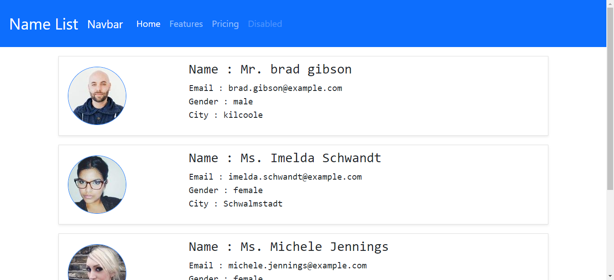

# Getting Started with Create React App
This is My first project with React framework. I am covering basic things through this project.

## Concept
I have created person details cards and i have added some styles using bootstrap. And also, i have created nav bar as an example. all things are responsive. you can check it through inspect tool. and i have used react component tree to creat this website. 

## Tools that i have used
- ReactJS
- Visual Studio Code
- Node Modules
- Bootstrap

## Demo of my website
- 
I am not going to develop this site any more. Because i had to get some understanding how react works. I have gained it through this project. if you are beginner i can highly recommend this type of web site to learn basic things of <b>React</b>.
 
 
### This is the [method](https://datamobteam.blogspot.com/2021/07/being-successful-with-being-self-taught.html) that following by me to learn new things. 
If you are interested you can follow those methods to learn something new ina a effective way.
